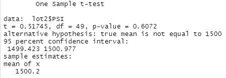

# MechaCar_Statistical_Analysis

## Linear Regression to Predict MPG

* There are two variables that will provide a non-random amount of variance to the mpg values. Vehicle length and ground clearance are those two variables that provide a significant impact to the fuel economy of the prototype. 
* The slope of the linear model is not-zero. The p-value of 5.35e-11 indicates this. 
* This model is fairly accurate in predicting the mpg of the prototypes effectivly. The multiple R-squared number of 0.7149 indicates an accuracy rating of 71%.

## Summary Statistics on Suspension Coils

Looking at the total summary of all of the manufacturing lot we can see the variance PSI of the suspenion coils is 62.29. This exceeds the standard variance of 100 PSI. However, looking at the indiviual lots we do see an issue. Lot 3 is currently producing at a variance of 170.29 which does not meet requirements. This indicates there are production problems at this lot. Once impoved the total variance would improve significantly. To summarize, yes the standard is being met but when looked at contextually, there are issues.

## T-Tests on Suspension Coils

The results of the t-test for all of the lots combined confirm what we read previously. The p-value is 0.06 which is higher than the 0.05 needed to reject the null hypothesis. Basically, there is not a significant difference in the production of the coils of all the lots combined from the mean of 1,500 PSI from the population.

However, once again this does not tell the whole story. Like in the previous deliverable we can say the same thing about lots 1 and 2 in deliverable 3 as we did in deliverable 2.
Lot 1 has a p-value of 1 because the production is right on the money with their mean production being at 1,500. Lot 2 is just slightly above at 1,500.2 but the p-value is .6. We cannot reject the null hypothesis with these results.

Once again lot 3 is showing signs of production issues. This test provides more evidence because the mean of production is 1,496.14, again matching deliverable 2. This time, the pvalue is .4, lower than the .5. This means we can reject the null hypothesis and this lot needs to be looked at in why the standards are not being met.

## Study Design: MechaCar vs Competition

To design a statistical study for MechaCar against the competetion an understanding of what consumers look for needs to be at the forefront. Consumers will vary in not just what they want in a vehicle but what is considered more or less important varies just as much. 
### Metrics
Some metrics to be measured include
* MPG highway and city
* Engine types (gas, hybrid, electric)
* MPH (especially when compared against like and different engine types)
* Horsepower
* Acceleration
* Braking distance
* Cabin space
* Emissions
* Handling
* Maintenance cost
* Insurance cost
* Safety rating
* Features
The list and combinations are endless.
### Hypothesis
The hypothesis would consider the pricing of the MechaCar compared to competitors in relation to the metrics tested. MechaCar is priced competitively with its features compared to other automobiles in its class would be the null hypothesis. The alternative is that is is not priced competitively with its features compared to other automobiles in its class.
### Test
I would chose a multiple linear regression test to run the analysis. This can be used to see what metrics impact price the most and determine which factors matter to consumers the most. 
